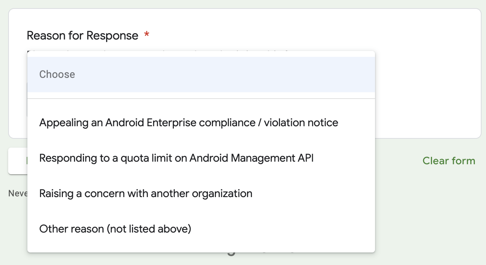

Google have made one of the most significant changes to permissible use of AMAPI in the last few years, imposing new limits for the number of devices permitted to enrol without validating a solution for commercial availability (that being applying for the EMM community & validating up to a minimum of Standard solution set support). 

The reasoning hasn't been provided, but my own experience of receiving requests for support and/or consultancy on an almost-weekly basis for projects that go entirely against permissible use (financing/leasing tools, internal EMM projects, etc) tells me this has been a wide-spread and troubling issue for the AMAPI team for quite a long time. 

As ever, it is the actions of the few that spoil it for the rest of us.

## What's changing

Google's [Permissible Usage](https://developers.google.com/android/management/permissible-usage) page has updated from no explicit maximum number of devices per project (it was a soft 1000 prior, referenced below) to now topping out at 500 devices. 

| Before | After |
| -------|-------|
| _No mention_ | Default quota of 500 registered devices for each project. | 

In addition, the [Android Enterprise features list (requirements)](https://developers.google.com/android/work/requirements) has additionally been updated from the prior 1000 devices to reflect the updated quota:

| Before | After |
| -------|-------|
| If you intend to manage more than **1000** devices, your EMM solution must support all the standard features (star) of at least one solution set before it can be made commercially available. | If you intend to manage more than **500** devices, your EMM solution must support all the standard features (star) of at least one solution set before it can be made commercially available. |

The prior 1000-limit was written, but not actively (automatically) enforced, allowing project owners to break this barrier without much in the way of immediate repercussions; of course any considerable use of the API would catch Google's attention eventually.

So what's different now?

The AMAPI API now enforces this quota, which wasn't the case before. The addition of two new events returned to project administrators via a `UsageLogEvent`, which is a collection of various events logged on devices from the use of ADB to power on/off, external media mounting, and so on, suggest the API itself has the limits baked right in: 

```
"MAX_DEVICES_REGISTRATION_QUOTA_WARNING",
"MAX_DEVICES_REGISTRATION_QUOTA_EXHAUSTED"
```

No room for interpretation here. The API offers two states: a near-quota warning (the number which triggers this not published at time of writing), and a quota-reached state, presumably at which point further enrolments will either be wiped, or disabled (..and wiped after 5 minutes, which is standard behaviour for disabled devices on enrolment without a valid policy applied today). That's speculation until it's appropriately documented, though, since currently it is not documented under the [EventType](https://developers.google.com/android/management/reference/rest/v1/EventType) docs.

Interesting, but probably not overly strange, is using device events to trigger these states. I suppose it is a device registering with AMAPI that triggers the states, and so it works that the device informs the enterprise of quota warnings/limits. I'd have expected it to be pushed as an enterprise attribute though without reading too much more into it. Perhaps it'll make more sense once Google document it.

## Exceptions continue

Despite the addition of these new, actively enforced quotas, it remains possible to request a higher limit on a case by case basis. Google now provide a form to - amongst other things - "respond to a quota limit": 



Interesting also is this used to be a Google Cloud process, which suggests to me the Android Enterprise team are foregoing the established Google Cloud processes in favour of a more hands-on - and hopefully _personal_ interaction with project owners.

## What does this mean for the unvalidated?

Project owners today, prospective EMM vendors or scenarios where AMAPI is in use that _don't_ breach permissible usage policies running over 500 devices should at minimum register their AMAPI solution with the [EMM partner portal](https://emm.androidenterprise.dev). If you haven't already started seeing quota warnings, you will soon. Obviously if it's not yet feasible to validate up to Standard solution set support, the form ([https://goo.gle/android-enterprise-response](https://goo.gle/android-enterprise-response)) may offer a bit of runway.

For everyone else not quite at the point of hitting the limit, make preparations to validate your product with the AMAPI team before that threshold is reached.

## Closing thoughts

Obviously this won't solve the problem of AMAPI being either abused intentionally or used in ways Google doesn't permit. There's little to stop those driven to do so from spinning up multiple projects across multiple accounts in an ever-continuing game of cat and mouse. 

It is a deterrent though, an additional overhead to have to manage to make it worth-while, and perhaps that'll make enough of a difference to justify the engineering time (that could have been dedicated to offline system update management or ephemeral user support, just sayin' 😁) to implement this.